# React. Task #6 React Performance
## Install instructions:

```bash
1. git clone https://github.com/ordinaraviro/rss-react.git
2. git checkout performance
3. npm i
4. npm run dev
```
## Performance

### Initial render
* Committed at: 0.2s
* Render Duration: 92.8ms
* Interaction: initial app render

<details>
<summary>Screenshots</summary>

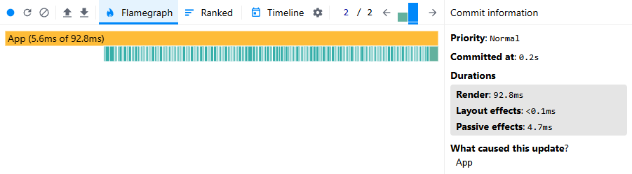

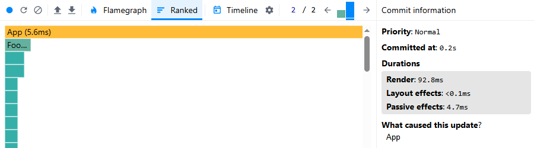
</details>

### Initial render after optimization
* Committed at: 0.2s
* Render Duration: 94.9ms
* Interaction: initial app render

<details>
<summary>Screenshots</summary>

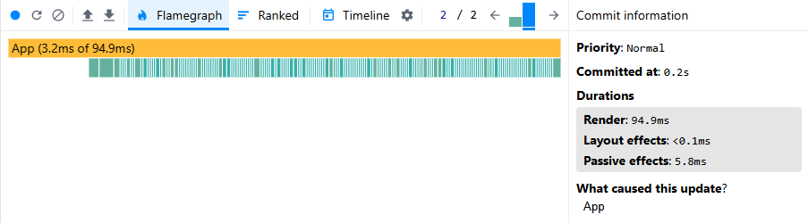

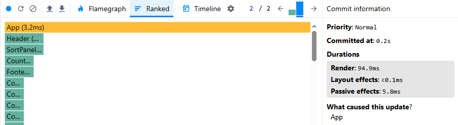
</details>

### Sort by region
* Committed at: 3.5s
* Render Duration: 6.6ms
* Interaction: change selected region

<details>
<summary>Screenshots</summary>

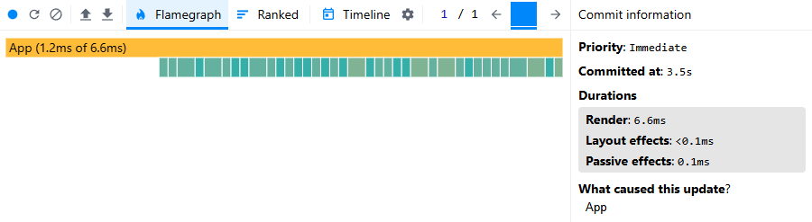

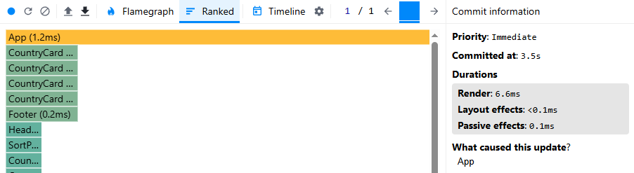
</details>

### Sort by region after optimization
* Committed at: 1.8s
* Render Duration: 1.4ms
* Interaction: change selected region

<details>
<summary>Screenshots</summary>

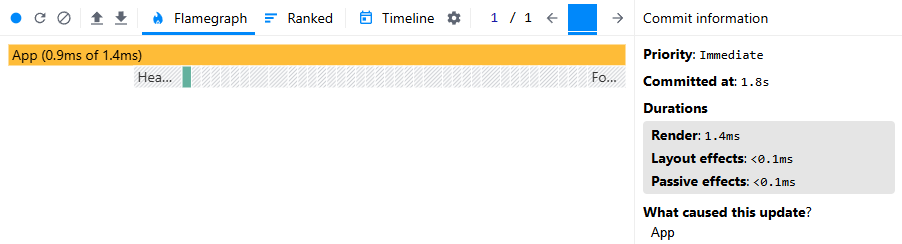

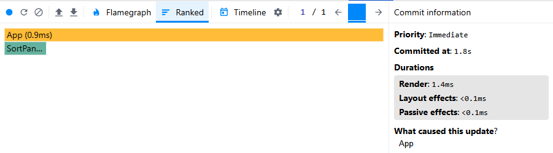
</details>

### Sort by population
* Committed at: 5.5s
* Render Duration: 4.9ms
* Interaction: change sort query

<details>
<summary>Screenshots</summary>

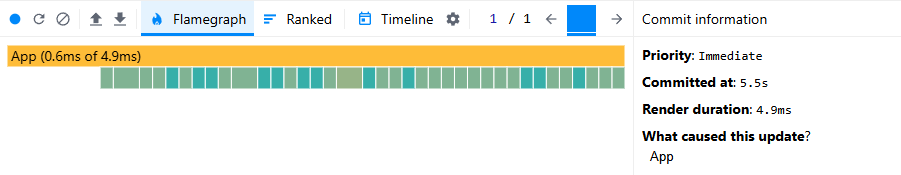

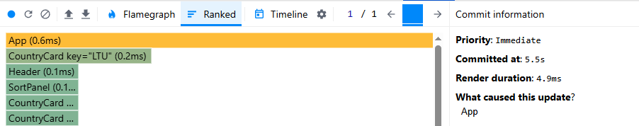
</details>

### Sort by population after optimization
* Committed at: 2.2s
* Render Duration: 1ms
* Interaction: change sort query

<details>
<summary>Screenshots</summary>

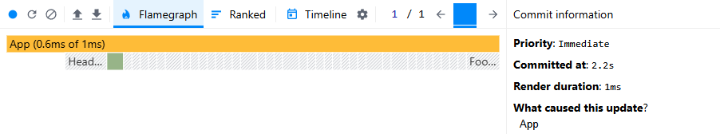

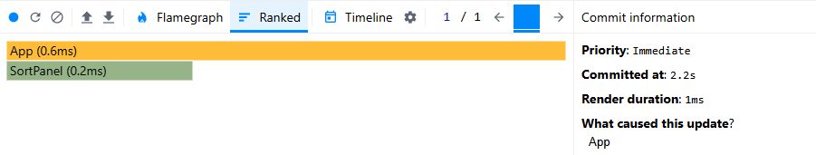
</details>

### Search by letter 'c'
* Committed at: 3.9s
* Render Duration: 3.2ms
* Interaction: change search query

<details>
<summary>Screenshots</summary>

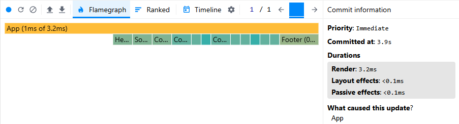

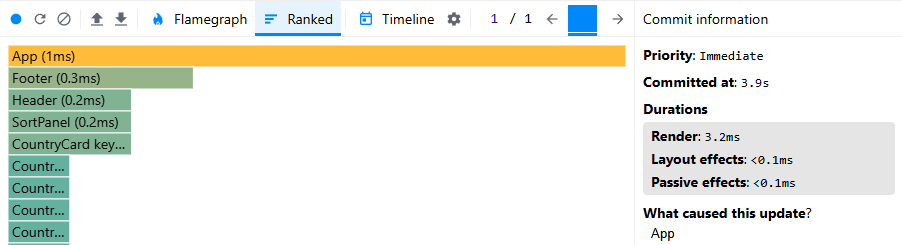
</details>

### Search by letter 'c' after optimization
* Committed at: 1.6s
* Render Duration: 1.1ms
* Interaction: change search query

<details>
<summary>Screenshots</summary>

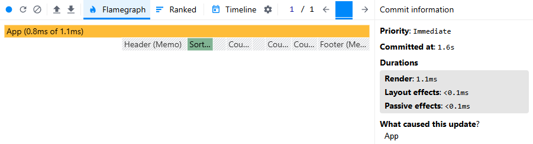

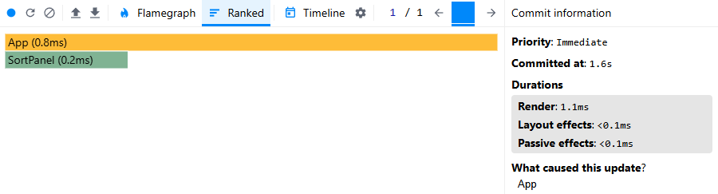
</details>

### Repeat search by letter 'c'
* Committed at: 1.5s
* Render Duration: 2.7ms
* Interaction: repeat the same search query

<details>
<summary>Screenshots</summary>

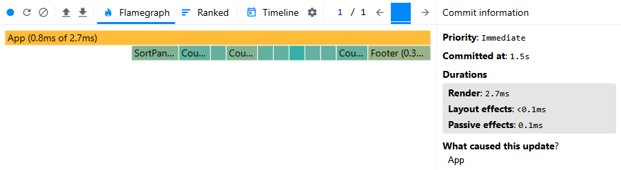

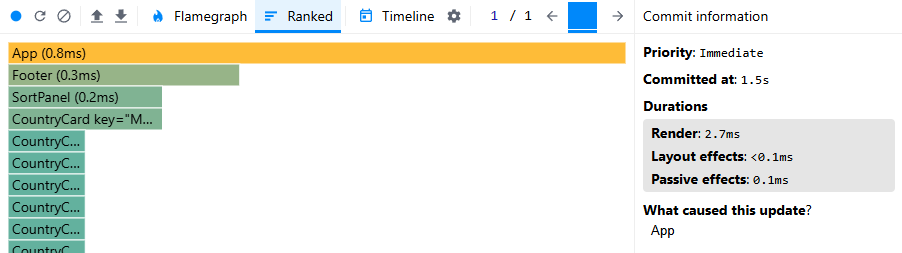
</details>

### Repeat search by letter 'c' after optimization
* Committed at: 1.4s
* Render Duration: 0.5ms
* Interaction: repeat the same search query

<details>
<summary>Screenshots</summary>

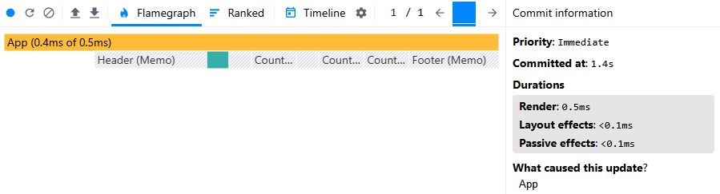

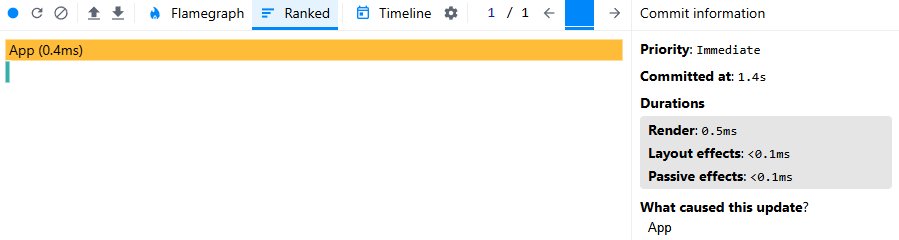
</details>

## Performance Summary

After implementing performance optimizations, significant improvements were observed across all interactions:
* **Initial Render**: No performance regression—committed time and render duration remained stable.
* **Sorting by Region**: Render duration reduced from 6.6ms to 1.4ms, cutting rendering time by over 75%.
* **Sorting by Population**: Render duration reduced from 4.9ms to 1ms, achieving a 79% improvement.
* **Search Query ("C")**: Render duration reduced from 3.2ms to 1.1ms, an improvement of 65%.
* **Repeat Search Query ("C")**: Render duration dropped further, from 2.7ms to 0.5ms, a decrease of over 80%.

These optimizations ensure smoother and faster interactions, enhancing user experience significantly
